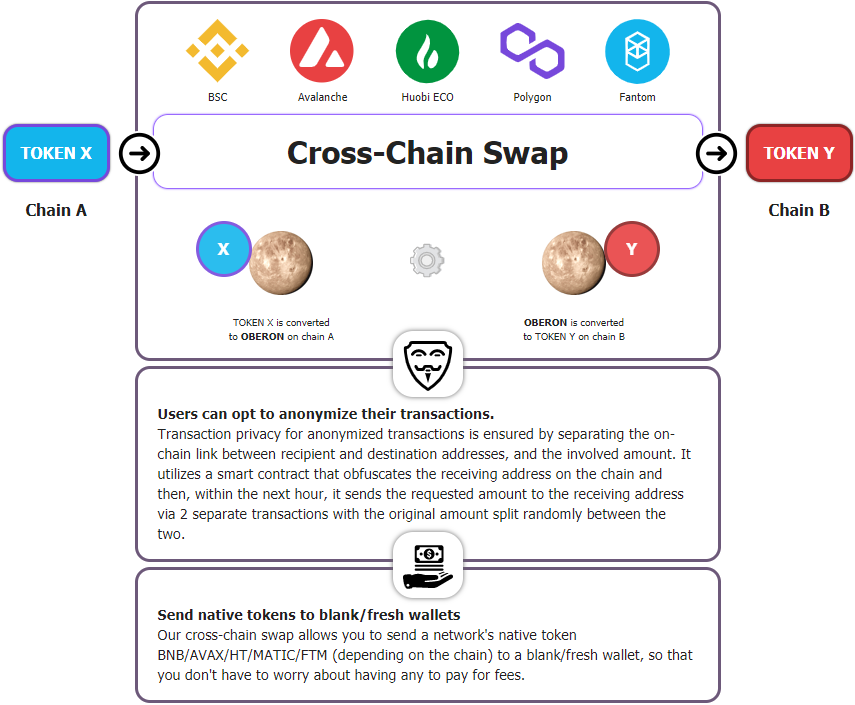

# 🏫 Home

## Introduction 

DXAMMFinance is the Galactic yield farm and home of the first and most easy to use ✨[cross-chain swap](features/token-bridge.md), running on [Binance Smart Chain](https://www.binance.org/en/smartChain), [Avalanche](https://www.avax.network/), [Huobi Eco \(HECO\)](https://www.hecochain.com/en-us/), [Polygon](https://polygon.technology/) and [Fantom](https://fantom.foundation/), with yield farming, auto-compounding vaults, staking, referral program, lottery and more.

Our contracts are **exact 1:1 forks** of thoreum.finance's contracts which are [audited by Paladin and CertiK](security/audits.md).

## **Main Features** 

* [Presale](presale.md)
* The first and the most easy to use ✨[cross-chain swap](features/token-bridge.md), allowing you to easily transfer your assets between the 5 chains:
  * [Binance Smart Chain](https://www.binance.org/en/smartChain)
  * [Avalanche](https://www.avax.network/)
  * [Huobi Eco \(HECO\)](https://www.hecochain.com/en-us/)
  * [Polygon](https://polygon.technology/)
  * [Fantom](https://fantom.foundation/)
* [Farms](features/harvest-lockup.md) where you deposit LP tokens to earn TKENB with high APYs
* [Pools](features/token-pools.md) where you deposit single tokens and earn TKENB with high APYs
* [Vaults](features/vaults.md) where you deposit LPs or single tokens and these \(the deposited LP tokens and/or single tokens, not TKENB!\) are automatically and optimally compounded for you
* [Lottery](features/lottery.md) with ticket price always set to **$2**, regardless of the token's price
* improved [Referral Program](features/referral-program.md) where you now know who your referrer is and **you** are the one deciding if you want to have a referrer at all, who your referrer is, and when to confirm your referrer
* ownership of all contracts already transferred to the **24 hours** [Timelock](security/timelock.md)
* [Locked Liquidity](features/locked-liquidity.md)
* [Anti Whale](features/anti-whale.md) mechanism preventing Whales from quickly buying/selling large amounts \(pump & dump\)
* [No Migrator Code](security/no-migrator-code.md)

### About TKENB 

| Assignment | Amount | Percentage |
| :--- | :--- | ---: |
| Total supply: | 5,000,000,000 | 100% |
| Burned: | 2,000,000,000 | 40% |
| Liquidity mining: | 1,000,000,000 | 20% |
| Locked in [bridge](features/token-bridge.md): | 1,000,000,000 | 20% |
| Used in [presale](presale.md): | 499,900,000 available for buying | 9.99% |
|  | 499,900,000 used for pairing with the assets collected  from the presale and providing [locked liquidity](features/locked-liquidity.md) for farms | 9.99% |
| Devs: | 100,000 \(used for marketing purposes\) | 0.01% |
| Giveaway | 100,000 | 0.01% |

TKENB is mined via **liquidity mining** where users can mine TKENB by staking other coins such as BNB, BUSD, ETH, etc., or by staking liquidity pairs \(LPs\) such as BNB-BTCB, BNB-ETH, etc.

[Read more](tokenomics/tkenb.md) about TKENB.

