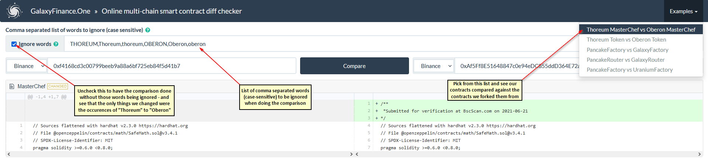

# 📕 Audits

## Audits

Our **MasterChef contract** is an **exact 1:1 fork** of thoreum.finance's MasterChef contract; [here are the 2 contracts compared](https://bscscan.com/contractdiffchecker?a1=0xf4168cd3c00799beeb9a88a6bf725eb84f5d41b7&a2=0xAf5Ff8E51648847c0e94eDC855ddD364E72a66EF) \(you have to click on the "Compare Difference" button at the bottom\) - you will notice that the only difference is that we changed all instances of **THOREUM** to **TKENB**.   
  
Our **Token contract** is an **exact 1:1 fork** of thoreum.finance's Token contract; [here are the 2 contracts compared](https://bscscan.com/contractdiffchecker?a1=0x580de58c1bd593a43dadcf0a739d504621817c05&a2=0xc979E70611D997Aa109528c6A9aa73D82Eaa2881) \(you have to click on the "Compare Difference" button at the bottom\) - you will notice that the only difference is that we changed all instances of **THOREUM** to **TKENB**. 

thoreum.finance's contracts were audited by [**Paladin BlockChain Security**](https://docs.thoreum.finance/security/audits)**,** [**CertiK**](https://docs.thoreum.finance/security/audits) ****and ****[**Techrate**](https://docs.thoreum.finance/security/audits) \(paid version\)**.**

We have created a [friendlier tool](https://galaxyfinance.one/contractdiffchecker.html?ignore=THOREUM%2CThoreum%2Cthoreum%2COBERON%2COberon%2Coberon&ignore_words=1&chain1=Binance&address1=0x580de58c1bd593a43dadcf0a739d504621817c05&chain2=Binance&address2=0xc979E70611D997Aa109528c6A9aa73D82Eaa2881) to make it easier for you to spot the differences between our contracts and the ones we forked them from. Below is a screenshot of its output and some explanations regarding its functionality.

We wanted to have our contracts audited anyways by Paladin and we contacted them in this regard, mentioning that our contracts are exact forks of thoreum.finance's and they replied with a **15K** quote so, unfortunately, we are unable to pay for an audit from them.

